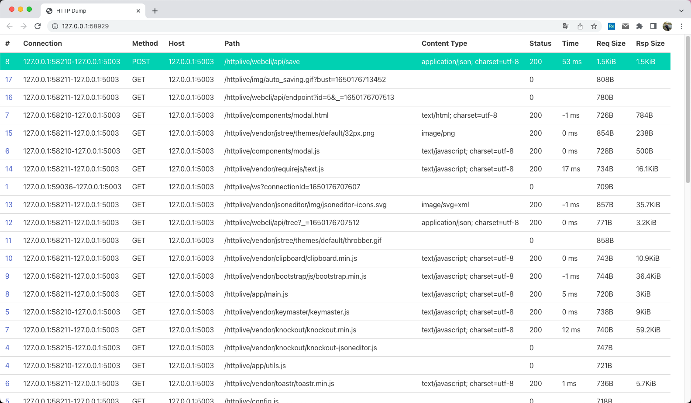

# httpdump

Parse and display http traffic from network device or pcap file. This is a go version of origin pcap-parser, thanks to
gopacket project, this tool has simpler code base and is more efficient.

Forked from [httpdump](https://github.com/hsiafan/httpdump), For original python
implementation, [refer to httpcap on pypi](https://pypi.org/project/httpcap/).

## Features support

1. 2023-12-04 增加 docker 编译支持（基于 docker.elastic.co/beats-dev/golang-crossbuild)
2. 2022-06-29 `-rr` to keep request and its relative response in order.

### Install

1. mac `make install1`
2. linux `make install`
3. docker 编译 linux amd64 （推荐）
    1. `make amd64-docker` 构建 docker 容器
    2. `make vendor` 下载所有依赖包到 vendor 目录，省却容器内再次下载
    3. `make amd64` 使用容器构建
4. 从 pcap 源代码静态链接 pcap包（在需要更高版本的 pcap 包时使用）

   ```sh
   $ export PCAPV=1.10.14
   $ wget http://www.tcpdump.org/release/libpcap-$PCAPV.tar.gz
   $ tar -zxvf libpcap-$PCAPV.tar.gz
   $ cd libpcap-$PCAPV
   $ ./configure
   $ make

   $ pkg-config --cflags --libs libnl-3.0 libnl-genl-3.0
   -I/usr/include/libnl3  -lnl-genl-3 -lnl-3

   $ CGO_CFLAGS="-I/root/libpcap-1.10.4" CGO_LDFLAGS="-L/root/libpcap-1.10.4 -lnl-genl-3 -lnl-3" go build

   $ ls -hl httpdump
   -rwxr-xr-x 1 root root 22M Nov 30 22:56 httpdump
   $ upx httpdump
   $ ls -hl httpdump
   -rwxr-xr-x 1 root root 13M Nov 30 22:56 httpdump
   ```

   参考
    - [Golang交叉编译中使用libpcap链接库](https://aoyouer.com/posts/golang-cross-compile-link/)
    - [make an option to compile libraries statically](https://github.com/google/gopacket/issues/424)


非 pcap 静态编译时需要安装 libpcap 包

1. for ubuntu/debian: `sudo apt install libpcap-dev`
2. for centos/redhat/fedora: `sudo yum install libpcap-devel`
3. for osx: Libpcap and header files should be available in macOS already.
4. install libpcap from source
   1. Fetch libpcap dependencies. Depending on your OS, instead of `apt` you will use `yum` or `rpm`, or `brew` on
      Mac. `sudo apt-get install flex bison -y`
   2. download `gurl https://www.tcpdump.org/release/libpcap-1.10.1.tar.gz`
   3. install `tar zxf libpcap-1.10.1.tar.gz && cd libpcap-1.10.1 && ./configure && make install`


## Cheatsheet

1. 监听发往 192.168.1.1:80 的 HTTP POST 请求及响应，并且写到日志文件 `log-yyyy-MM-dd.http` 中，按 100m 滚动(例如
   log-yyyy-MM-dd_00001.http)，同时往
   192.168.1.2:80 复制。

`nohup httpdump -bpf "tcp and ((dst host 192.168.1.1 and port 80) || (src host 192.168.1.1 and src port 80))" -method POST -output log-yyyy-MM-dd.http:100m -output 192.168.1.2:80 2>&1 >> httpdump.nohup &`

## Usage

httpdump can read from pcap file, or capture data from network interfaces. Usage:

```sh
$ httpdump -h
Usage of httpdump:
  -bpf string   Customized bpf, if it is set, -ip -port will be suppressed, e.g. tcp and ((dst host 1.2.3.4 and port 80) || (src host 1.2.3.4 and src port 80))
  -c string     yaml config filepath
  -chan uint    Channel size to buffer tcp packets (default 10240)
  -curl Output an equivalent curl command for each http request
  -daemonize    daemonize and then exit
  -debug        Enable debugging.
  -dump-body string     Prefix file of dump http request/response body, empty for no dump, like solr, solr:10 (max 10)
  -eof  Output EOF connection info or not.
  -f string     File of http request to parse, glob pattern like data/*.gor, or path like data/, suffix :tail to tail files, suffix :poll to set the tail watch method to poll
  -fla9 string  Flags config file, a scaffold one will created when it does not exist.
  -force        Force print unknown content-type http body even if it seems not to be text content
  -host string  Filter by request host, using wildcard match(*, ?)
  -i string     Interface name or pcap file. If not set, If is any, capture all interface traffics (default "any")
  -idle duration        Idle time to remove connection if no package received (default 4m0s)
  -init init example httpdump.yml/ctl and then exit
  -ip string    Filter by ip, or ip range like 1.1.1.1-1.1.1.3, or multiple ip like 1.1.1.1,1.1.1.3, if either src or dst ip is matched, the packet will be processed
  -level string Output level, url: only url, header: http headers, all: headers and text http body (default "all")
  -method string        Filter by request method, multiple by comma
  -mode string  std/fast (default "fast")
  -n value      Max Requests and Responses captured, and then exits
  -out-chan uint        Output channel size to buffer tcp packets (default 40960)
  -output value 
        File output, like dump-yyyy-MM-dd-HH-mm.http, suffix like :32m for max size, suffix :append for append mode
        Or Relay http address, eg http://127.0.0.1:5002
        Or any of stdout/stderr/stdout:log
  -port string  Filter by port, or port range like 8001-8003, or multiple ports like 8001,8003, if either source or target port is matched, the packet will be processed
  -pprof string pprof address to listen on, not activate pprof if empty, eg. :6060
  -r value      -r: print response, -rr: print response after relative request 
  -rate float   rate limit output per second
  -replay-ratio float   replay ratio, e.g. 2 to double replay, 0.1 to replay only 10% requests (default 1)
  -src-ratio float      source ratio, e.g. 0.1 should be (0,1] (default 1)
  -status value Filter by response status code. Can use range. eg: 200, 200-300 or 200:300-400
  -uri string   Filter by request url path, using wildcard match(*, ?)
  -v    Print version info and exit
  -verbose string       Verbose flag, available req/rsp/all for http replay dump
  -web  Start web server for HTTP requests and responses event
  -web-context string   Web server context path if web is enable
  -web-port int Web server port if web is enable
```

## Samples

A simple capture:

```sh
🕙[2021-05-22 18:05:03.891] ❯ sudo httpdump -i lo0 -port 5003 -r -level all

### REQUEST  ::1:59982 ea4e138b00000001b295aafb -> ::1:5003 2021-05-22T18:05:16.065566+08:00
POST /echo/123 HTTP/1.1
Content-Length: 18
Host: localhost:5003
User-Agent: HTTPie/2.4.0
Accept-Encoding: gzip, deflate
Accept: application/json, */*;q=0.5
Connection: keep-alive
Content-Type: application/json

{
    "name": "bingoo"
}


### RESPONSE  ::1:59982 ea4e138b00000001b295aafb <- ::1:5003 2021-05-22T18:05:16.065566+08:00 - 2021-05-22T18:05:16.065566+08:00 = 0s
HTTP/1.1 200 OK
Content-Type: application/json; charset=utf-8
Date: Sat, 22 May 2021 10:05:16 GMT
Content-Length: 474

{
    "headers": {
        "Accept": "application/json, */*;q=0.5",
        "Accept-Encoding": "gzip, deflate",
        "Connection": "keep-alive",
        "Content-Length": "18",
        "Content-Type": "application/json",
        "User-Agent": "HTTPie/2.4.0"
    },
    "host": "localhost:5003",
    "method": "POST",
    "payload": {
        "name": "bingoo"
    },
    "proto": "HTTP/1.1",
    "remoteAddr": "[::1]:59982",
    "requestUri": "/echo/123",
    "router": "/echo/:id",
    "routerParams": {
        "id": "123"
    },
    "timeGo": "2021-05-22 18:05:16.0625",
    "timeTo": "2021-05-22 18:05:16.0625",
    "url": "/echo/123"
}
```

More:

```sh
# parse pcap file
sudo tcpdump -wa.pcap tcp
httpdump -i a.pcap

# capture specified device:
httpdump -i eth0

# filter by ip and/or port
httpdump -port 80  # filter by port
httpdump -ip 101.201.170.152 # filter by ip
httpdump -ip 101.201.170.152 -port 80 # filter by ip and port
```

## Help

抓取到指定IP端口的请求及相应的bpf

`httpdump -bpf "tcp and ((dst host 192.168.1.1 and dst port 5003) or (src host 192.168.1.1 and src port 5003))"  -method POST`

## 部署

1. 查看版本：`httpdump -v` 最新版本是：httpdump v1.2.7 2021-06-21 14:13:46
2. 生成样例 yml 配置文件  `httpdump -init`
3. 编辑 yml 配置文件 `httpdump.yml`，调整取值
4. 启动 `httpdump -c httpdump.yml`，测试观察是否正常运行（可能参数配置不正确，无法抓到正常的包）
5. 修改 `httpdump.yml` 中的配置项为 `daemonize: true`，重新启动  `httpdump -c httpdump.yml`，进入后台运行状态
    - 日志文件在当前目录下的 httpdump.log 文件中

httpdump.yml 配置示例:

```yml
# 监听 ip
ip: 192.168.126.5
# 监听 端口
port: 5003
# 注意：ip 和 port 同时配置时，相当于设置了 bpf: tcp and ((dst host {ip} and dst port {port}) or (src host {ip} and src port {port}))

# 监听 http 方法
method: POST
# 输出 http 请求包
output:
  - post-yyyy-MM-dd.log:100M     # 记录到日志文件，按天滚动，每个文件最大100M
  - "http://192.168.126.18:5003" # 重放到其它服务
  # - stdout
```

## 删除大量文件

`find . -type f -name 'log-*'  -delete`

## 采集 CPU profile

1. 在工作目录下：`touch jj.cpu; kill -USR1 {pid}`，开始采集，等待 5-10 分钟，再次执行相同命令，结束采集，可以在当前目录下看到生成的
   cpu.profile`文件
2. 下载文件到本地，使用go工具链查看，例如： `go tool pprof -http :9402 cpu.profile`

## Web UI

`sudo httpdump -port 5003 -r -web -web-port 6003 -web-context httpdump`



## PRINT_JSON=Y

```sh
$ sudo PRINT_JSON=Y httpdump -i lo0 -port 5003 -r -level all
{"seq":1,"src":"127.0.0.1:49546","dest":"127.0.0.1:5003","timestamp":"2022-05-07T23:26:34.136481+08:00","requestUri":"/v","method":"GET","host":"127.0.0.1:5003","header":{"Accept":["application/json"],"Accept-Encoding":["gzip, deflate"],"Content-Type":["application/json"],"Gurl-Date":["Sat, 07 May 2022 15:26:34 GMT"],"Host":["127.0.0.1:5003"],"User-Agent":["gurl/1.0.0"]},"body":""}
{"seq":1,"src":"127.0.0.1:49546","dest":"127.0.0.1:5003","timestamp":"2022-05-07T23:26:34.136549+08:00","header":{"Content-Type":["application/json; charset=utf-8"],"Date":["Sat, 07 May 2022 15:26:34 GMT"],"Vary":["Accept-Encoding"]},"body":{"build":"2022-05-07T23:21:12+0800","git":"master-a42347e@2022-05-05T19:10:41+08:00","go":"go1.18.1_darwin/amd64","version":"1.3.5"},"statusCode":200}
{"seq":1,"src":"127.0.0.1:49661","dest":"127.0.0.1:5003","timestamp":"2022-05-07T23:27:18.967138+08:00","requestUri":"/v","method":"POST","host":"127.0.0.1:5003","header":{"Accept":["application/json"],"Accept-Encoding":["gzip, deflate"],"Content-Length":["27"],"Content-Type":["application/json"],"Gurl-Date":["Sat, 07 May 2022 15:27:18 GMT"],"Host":["127.0.0.1:5003"],"User-Agent":["gurl/1.0.0"]},"body":{"age":10,"name":"bingoo"}}
{"seq":1,"src":"127.0.0.1:49661","dest":"127.0.0.1:5003","timestamp":"2022-05-07T23:27:18.967165+08:00","header":{"Content-Type":["application/json; charset=utf-8"],"Date":["Sat, 07 May 2022 15:27:18 GMT"],"Vary":["Accept-Encoding"]},"body":{"build":"2022-05-07T23:21:12+0800","git":"master-a42347e@2022-05-05T19:10:41+08:00","go":"go1.18.1_darwin/amd64","version":"1.3.5"},"statusCode":200}
{"seq":1,"src":"127.0.0.1:49718","dest":"127.0.0.1:5003","timestamp":"2022-05-07T23:27:40.348368+08:00","requestUri":"/echo","method":"POST","host":"127.0.0.1:5003","header":{"Accept":["application/json"],"Accept-Encoding":["gzip, deflate"],"Content-Length":["27"],"Content-Type":["application/json"],"Gurl-Date":["Sat, 07 May 2022 15:27:40 GMT"],"Host":["127.0.0.1:5003"],"User-Agent":["gurl/1.0.0"]},"body":{"age":10,"name":"bingoo"}}
{"seq":1,"src":"127.0.0.1:49718","dest":"127.0.0.1:5003","timestamp":"2022-05-07T23:27:40.348461+08:00","header":{"Content-Type":["application/json; charset=utf-8"],"Date":["Sat, 07 May 2022 15:27:40 GMT"],"Vary":["Accept-Encoding"]},"body":{"Ua-Bot":false,"Ua-Browser":"gurl","Ua-BrowserVersion":"1.0.0","Ua-Engine":"","Ua-EngineVersion":"","Ua-Localization":"","Ua-Mobile":false,"Ua-Mozilla":"","Ua-OS":"","Ua-OSInfo":{"FullName":"","Name":"","Version":""},"Ua-Platform":"","headers":{"Accept":"application/json","Accept-Encoding":"gzip, deflate","Content-Length":"27","Content-Type":"application/json","Gurl-Date":"Sat, 07 May 2022 15:27:40 GMT","User-Agent":"gurl/1.0.0"},"host":"127.0.0.1:5003","method":"POST","payload":{"age":10,"name":"bingoo"},"proto":"HTTP/1.1","remoteAddr":"127.0.0.1:49718","requestUri":"/echo","timeGo":"2022-05-07 23:27:40.3473","timeTo":"2022-05-07 23:27:40.3473","url":"/echo"},"statusCode":200}
```

## Environment Variables

| \# | Name          | Default | Meaning               | Changing                |
|----|---------------|---------|-----------------------|-------------------------|
| 1  | MAX_BODY_SIZE | 4K      | Max HTTP body to read | export MAX_BODY_SIZE=4M |

## `application/x-www-form-urlencoded` supported

1. `httplive -p 5004`
2. `httpdump -port 5004 -r`

```sh
### #2 REQ 60.247.93.190:10713-10.0.24.15:5004 2022-06-27T10:19:53.552086+08:00
POST /form HTTP/1.1
Accept-Language: zh-CN,zh;q=0.9
Content-Length: 93
Content-Type: application/x-www-form-urlencoded
Origin: http://d5k.co:5004
Referer: http://d5k.co:5004/form
User-Agent: Mozilla/5.0 (Macintosh; Intel Mac OS X 10_15_7) AppleWebKit/537.36 (KHTML, like Gecko) Chrome/101.0.0.0 Safari/537.36
Accept: */*
Host: d5k.co:5004
Proxy-Connection: keep-alive
Dnt: 1
Accept-Encoding: gzip, deflate

firstName=bingoo&lastName=huang&email=bingoo.huang%40gmail.com&city=beijing&state=CA&terms=on
### #2 RSP 60.247.93.190:10713-10.0.24.15:5004 2022-06-27T10:19:53.552606+08:00
HTTP/1.1 200 OK
Content-Encoding: gzip
Content-Type: application/json; charset=utf-8
Vary: Accept-Encoding
Date: Mon, 27 Jun 2022 02:19:53 GMT
Content-Length: 136

{"Form":{"city":["beijing"],"email":["bingoo.huang@gmail.com"],"firstName":["bingoo"],"lastName":["huang"],"state":["CA"],"terms":["on"]},"Status":"OK"}
```

## `Content-Type: multipart/form-data;` supported

1. `httplive -p 5004`
2. `httpdump -port 5004 -r -force`

```sh
[root@VM-24-15-centos d5k]# go/bin/httpdump -port 5004 -r -force
### #1 REQ 60.247.93.190:15271-10.0.24.15:5004 2022-06-27T11:16:24.834517+08:00
POST /upload/ HTTP/1.1
Dnt: 1
Host: d5k.co:5004
Accept-Language: zh-CN,zh;q=0.9
Proxy-Connection: keep-alive
Referer: http://d5k.co:5004/upload/
Content-Length: 183
Content-Type: multipart/form-data; boundary=----WebKitFormBoundaryEIfowGQePgSXlNHa
Accept-Encoding: gzip, deflate
User-Agent: Mozilla/5.0 (Macintosh; Intel Mac OS X 10_15_7) AppleWebKit/537.36 (KHTML, like Gecko) Chrome/101.0.0.0 Safari/537.36
Accept: */*
Origin: http://d5k.co:5004

------WebKitFormBoundaryEIfowGQePgSXlNHa
Content-Disposition: form-data; name="file"; filename="u.txt"
Content-Type: text/plain

abc

------WebKitFormBoundaryEIfowGQePgSXlNHa--
### #1 RSP 60.247.93.190:15271-10.0.24.15:5004 2022-06-27T11:16:24.830528+08:00
HTTP/1.1 200 OK
Content-Encoding: gzip
Content-Type: application/json; charset=utf-8
Vary: Accept-Encoding
Date: Mon, 27 Jun 2022 03:16:24 GMT
Content-Length: 167

{"Files":["u.txt"],"FileSizes":["4B"],"TotalSize":"4B","Cost":"78.195µs","Start":"Mon, 27 Jun 2022 03:16:24 GMT","End":"Mon, 27 Jun 2022 03:16:24 GMT","MaxTempMemory":"16.8MB","LimitSize":"10.5MB"}
```

## bpf examples

1. Drop packets to or from any address in the 10.21.0.0/16 subnet:
   `not (net 10.21.0.0/16)`
2. Drop packets that have both source and destination addresses in the 10.21.0.0/16 subnet:
   `not (src net 10.21.0.0/16 and dst net 10.21.0.0/16)`
3. Drop packets that are from 10.21.1.2 or are headed to 10.21.1.3.
   `not (src host 10.21.1.2 or dst host 10.21.1.3)`
4. Combine both IP and HOST:
   `not (host 192.168.1.10) and not (host api.wxbug.net)`
5. Drop all port 53 traffic, both TCP & UDP:
   `not (port 53)`
6. Drop only UDP port 53 traffic:
   `not (udp port 53)`
7. Drop all IP protocol 50 (IPSEC) traffic:
   `not (ip proto 50)`
8. Drop all traffic on TCP ports 133 through 135.
   `not (tcp portrange 133-135)`
9. Drop any port 53(DNS) traffic sourced from 10.21.1.2 or destined to 10.21.1.3.
   `not (port 53) and not (src host 10.21.1.2 or dst host 10.21.1.3)`
10. Drop any traffic using IP proto 50 or port 53 or any traffic from net 10.21.0.0/16 destined to net 10.21.0.0/16
    `not (ip proto 50 or port 53) or not (src net 10.21.0.0/16 and dst net 10.21.0.0/16)`

## resources

1. [goreplay](https://github.com/buger/goreplay) a network monitoring tool which can record your live traffic and use it
   for shadowing, load testing, monitoring and detailed analysis.
